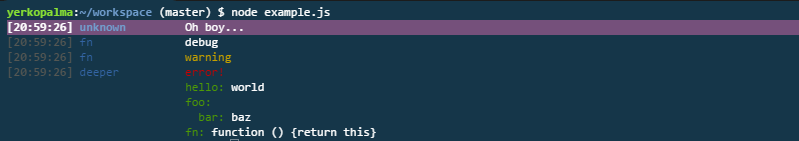

# tiny-log [](https://www.npmjs.com/package/@yerkopalma/tiny-log) 
[](https://travis-ci.org/YerkoPalma/tiny-log) [](https://codecov.io/github/yerkopalma/tiny-log) [](https://github.com/feross/standard)

> Simple and small logger for node and the browser.



# Install 

```bash
$ npm install --save-dev @yerkopalma/tiny-log
```

# Usage

```js
var Log = require('tiny-log')

// in production, all log messagges lower than warning will be omited
log = process.env.NODE_ENV === 'production'
            ? Log('warn')
            : Log('debug')

log.debug('debug')
log.warn('debug')
log.error('debug')
log.fatal('Oh boy...')

log.dump({
  hello: 'world'
})
```

Every log message, except dump messages, is composed by a timestamp, a context (the name of the caller function) and the formated message. If no context is provided (anonymous or undefined function) `'unknown'` is printed as context.
Dump messages, are some kinf of yaml representation of objects.

# license

[MIT](/license) © [Yerko Palma](https://github.com/YerkoPalma).
